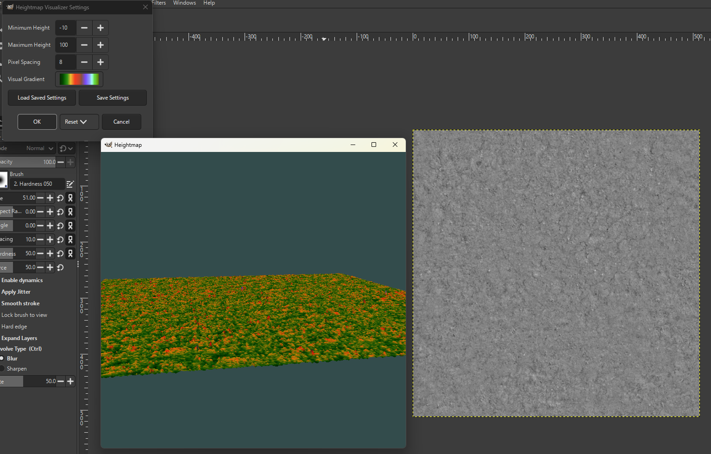
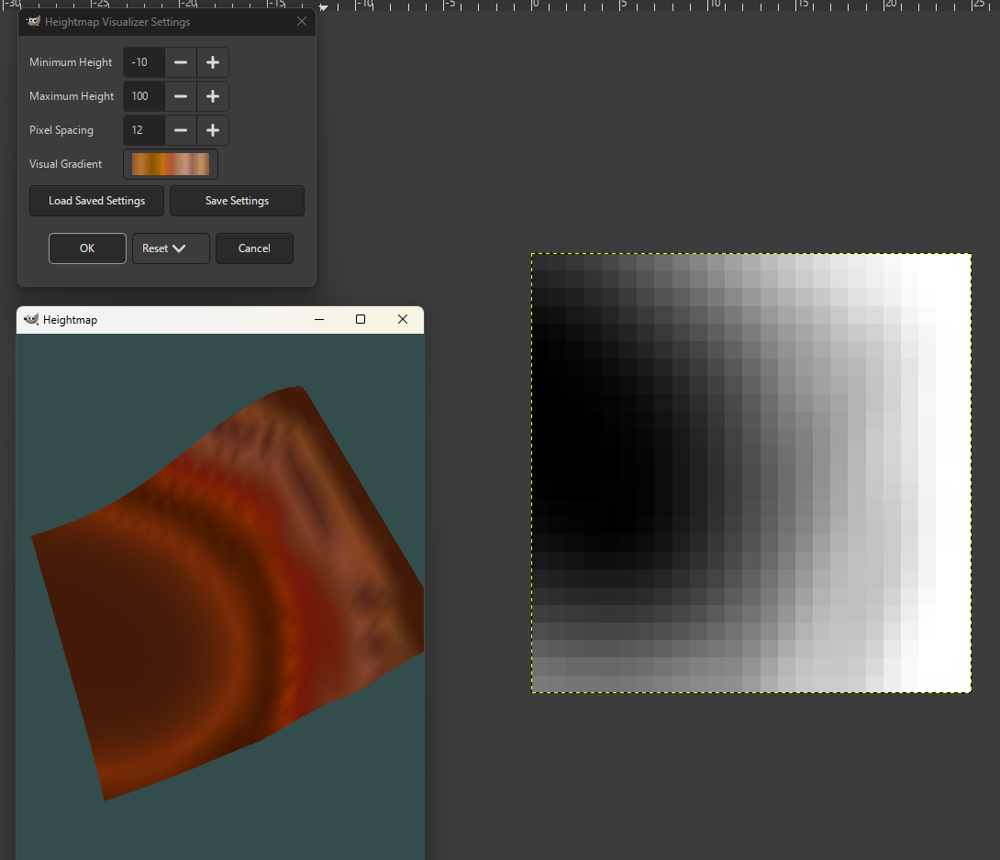
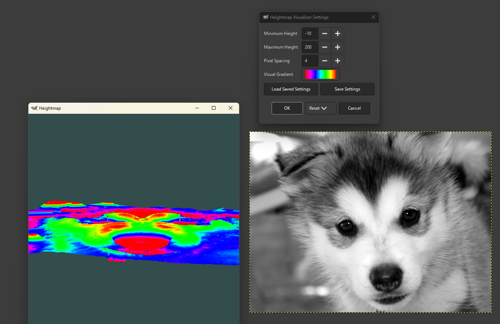

# heightmap-visualizer-vft
A gimp plugin to visualize the current layer as a 3d heightmap

# Installing
Download a release from the releases tab

And locate your plug-ins folder for your installation of gimp
* Windows: `%APPDATA%/GIMP/3.(VERSION)/plug-ins/`
* Linux: `$XDG_CONFIG_HOME/GIMP/3.(VERSION)/plug-ins/`
* Mac: `create NSApplicationSupportDirectory/GIMP/3.(VERSION)/plug-ins`

In this plug-ins folder, create a new folder named `heightmap-visualizer-vft` and install your downloaded executable into that folder

# Using
Open an image in GIMP (works best with greyscale)

Hit View/Heightmap Visualizer

Enter your preferred settings

Watch the beautiful visualization!

# Building

1. Download the gimp repository, and remember to clone it recursively
2. Build gimp according to their building guide
3. Edit the Makefile to point to your installations of GIMP and GIMP libraries
4. Remember to clone the submodules in this repository as well
5. Follow build directions in lib/libepoxy/README.md
6. The cglm library doesn't need to be build, as it's header-only
7. Then run `make build` and the executable should be present in this directory
8. Follow install instructions, or edit the Makefile's `install` target to install it to your GIMP

## If you're on windows
Download mingw and make sure you have make and gcc installed

# Gallery

A roughness texture

A low resolution image

A high resolution image
